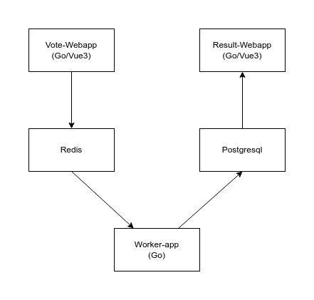

<h1 align="center">Kubernetes distributed voting app</h1>
<p align="center">
  <a href="https://github.com/hbollon/k8s-voting-app-aws/blob/master/LICENSE" target="_blank">
    
  </a>

<p align="center"> ☸️ Exemple d'application de vote distribué fonctionnant sur Kubernetes. Écrit en Golang avec des définitions Terraform pour déployer sur AWS EKS</p>

---

## Table of Contents

- [Presentation](#presentation)
  - [Architecture](#architecture)
  - [Project structure](#project-structure)
- [Getting Started](#getting-started)
  - [Run with Docker Compose](#run-with-docker-compose)
  - [Run with Kubernetes](#run-with-kubernetes)
    - [Minikube](#minikube)
      - [Using k8s templates](#using-k8s-templates)
      - [Using Helm Chart](#using-helm-chart)
    - [AWS](#aws)
- [Contributing](#-contributing)
- [Author](#author)
- [Show your support](#show-your-support)
- [License](#-license)

## Presentation

Ce repository fournit un exemple complet, moderne et prêt à être déployer d'une application de vote dockerisée et distribuée. Déployable à l'aide de [Docker-Compose](https://docs.docker.com/compose/), [Kubernetes](https://kubernetes.io/) ou même [Helm](https://helm.sh/) Chart.

### Architecture



### Project structure

```bash
k8s-voting-app-aws/
├─ .github/ # Github workflows
├─ docs/
│  ├─ app-architecture.jpg # App's architcture scheme
│  ├─ README-FR.md # French translation of the readme
├─ helm/ # Helm Chart definitions
├─ k8s-specifications/ # K8s Templates files
├─ voting-app/ # Result, Vote and Worker source code 
├─ *.tf # terraform specs files
├─ *.tfvars # terraform values files
├─ *.yml # docker-compose files
```

## Getting Started

### Run with Docker Compose

1. Téléchargez et installez [Docker](https://docs.docker.com/get-docker/) et [Docker-Compose](https://docs.docker.com/compose/install/)
2. Clonez ce repository: `git clone git@github.com:hbollon/k8s-voting-app-aws.git`
3. Ouvrez un terminal dans le repertoire clonner et construisez les images docker: `docker-compose build`
4. Démarrez les services: `docker-compose up -d`

L'application de résultat devrait maintenant être accessible via `localhost:9091` et celle de vote via `localhost:9090`
Pour arrêter toutes les ressources déployées, exécutez la commande: `docker-compose down`dlerror: libcudart.so.11.0: cannot open shared object file: No such file or directory

### Run with Kubernetes

#### Minikube

Avant de pouvoir déployer l'app, vous devez installer Minikube et lancer un cluster:

1. Installez [Minikube](https://minikube.sigs.k8s.io/docs/start/)
2. Démarrez un cluster Minikube: `minikube start`
3. Vérifiez le status du cluster (`minikube status`) et que kubectl soit bien lié a ce dernier (`kubectl get pods -A`)
4. Activez l'addon Nginx Ingress Controller: `minikube addons enable ingress`

##### Using k8s templates

1. Déployer les ressources k8s: `kubectl apply -f k8s-specifications --namespace=voting-app-stack`
2. Récupérer l'IP du cluster Minikube: `minikube ip`
3. Configurer l'accès à l'ingress:
   - **Sur Linux:** Modifier le fichier `/etc/hosts` en y ajoutant `<minikube ip> result.votingapp.com vote.votingapp.com` à la fin, bien sûr remplacer `<minikube ip>` par l'ip Minikube récupéré avant.
   - **Sur Windows:** Modifier le fichier `c:\Windows\System32\Drivers\etc\hosts` en y ajoutant `127.0.0.1 result.votingapp.com vote.votingapp.com` à la fin.
   Ensuite, démarrer un tunnel Minikube: `minikube tunnel`

L'application results est normalement maintenant accessible via `result.votingapp.com` et celle de vote via `vote.votingapp.com`
Pour détruire toutes les ressources k8s déployées, exécuter: `kubectl delete -f k8s-specifications --namespace=voting-app-stack` et pour stopper minikube: `minikube stop`

##### Using Helm Chart

1. Mettre à jour les Helm repositories et télécharger les dépendences: `helm dependency update ./helm/voting-app`
2. Déployer le Helm Chart: `helm template voting-app ./helm/voting-app --namespace=voting-app-stack | kubectl apply -f -`
3. Récupérer l'IP du cluster Minikube: `minikube ip`
4. Configurer l'accès à l'ingress:
   - **Sur Linux:** Modifier le fichier `/etc/hosts` en y ajoutant `<minikube ip> result.votingapp.com vote.votingapp.com` à la fin, bien sûr remplacer `<minikube ip>` par l'ip Minikube récupéré avant.
   - **Sur Windows:** Modifier le fichier `c:\Windows\System32\Drivers\etc\hosts` en y ajoutant `127.0.0.1 result.votingapp.com vote.votingapp.com` à la fin.
   Ensuite, démarrer un tunnel Minikube: `minikube tunnel`

L'application results est normalement maintenant accessible via `result.votingapp.com` et celle de vote via `vote.votingapp.com`
Pour détruire toutes les ressources k8s déployées, exécuter: `helm template voting-app ./helm/voting-app --namespace=voting-app-stack | kubectl delete -f -` et pour stopper minikube: `minikube stop`

#### AWS

Pour déployer l'application sur AWS, vous devez d'abord créer une infrastructure basée sur EKS (Elastic Kubernetes Service). Vous disposez de toutes les définitions Terraform nécessaires pour le faire facilement avec une interface IAC (Infrastructure As Code).
Vous devez disposer un compte AWS pour suivre ce guide et soyez prudent, bien qu'AWS propose un tier gratuit pour les nouveaux comptes, cette infrastructure peut générer des coûts, bien que très limités. Notamment en cas de mauvaise configuration ou utilisation, les coûts peuvent se voir multipliés.

**Je ne serai en aucun cas responsable des factures générés.**

1. Installer [Terraform](https://learn.hashicorp.com/tutorials/terraform/install-cli), [AWS-CLI](https://docs.aws.amazon.com/cli/latest/userguide/getting-started-install.html) et [KubeCTL](https://kubernetes.io/docs/tasks/tools/)

2. Cloner ce repo

3. Créez un nouvel utilisateur IAM sur votre compte AWS:
   - Allez dans la section IAM et créez un nouvel utilisateur nommé "TerraformUser"
   - Ajouter cet utilisateur à un nouveau groupe nommé "TerraformFullAccessGroup" avec les droits **AdministratorAccess** et **AmazonEKSClusterPolicy**
   - Une fois cela fait, conservez la _Secret Access Key_ et l'_Access Key ID_, ce sera la seule fois qu'AWS vous la donnera

4. Accédez au panneau VPC de la [console AWS] (https://console.aws.amazon.com/console/home) et obtenez deux identifiants de sous-réseau différents à partir du VPC par défaut. Ajoutez ces deux identifiants dans le fichier `values.tfvars` à la racine de ce projet (remplacez `<subnet_id_1>` et `<subnet_id_2>`).

5. Pour les étapes suivantes, vous devrez utiliser une méthode de gestion des informations d'identification pour les utiliser avec Terraform et AWS-CLI. Le moyen le plus simple consiste à définir les variables d'environnement AWS_ACCESS_KEY_ID et AWS_SECRET_ACCESS_KEY. Mais vous pouvez également utiliser des outils tels que [Summon](https://github.com/cyberark/summon) ou des fichiers de configuration AWS.

6. Ouvrez une console à la racine de ce répertoire de projet et exécutez:
  - `terraform init`
  - `terraform plan -var-file=values.tfvars`: vérifiez que la sortie est générée sans erreur.
  - `terraform apply -var-file=values.tfvars` (cette opération peut prendre un certain temps ne vous inquiétez pas)

7. Si les commandes précédentes fonctionnent bien, vous devriez maintenant avoir un cluster EKS fonctionnel. Pour y lier votre installation kubectl, vous devez exécuter: `aws eks update-kubeconfig --region eu-west-3 --name eks_cluster_voting_app` ** changez le drapeau de région si vous avez déployé l'EKS sur un autre**.
Une fois cela fait, exécutez `kubectl get pods -A`, si cela fonctionne, vous avez terminé avec votre nouveau cluster EKS.

8. Enfin, déployez toutes les ressources k8s:
   - Avec les modèles k8s: `kubectl apply -f k8s-specifications --namespace=voting-app-stack`
   - Avec Helm Chart : `helm dependance update ./helm/voting-app` et après : `helm template vote-app ./helm/voting-app --namespace=voting-app-stack | kubectl applique -f -`

Vous avez la possibilité d'obtenir le point de terminaison aws lié à votre cluster EKS en exécutant: `terraform output -json`. Cependant, la ressource d'entrée n'est pas compatible avec l'atm.

Vous pouvez tout détruire simplement en exécutant cette commande: `terraform destroy -var-file=values.tfvars`

**Ne supprimez jamais le fichier .tfstate généré lorsque l'infrastructure est déployée !** Sans cela vous ne pourrez pas supprimer toutes les ressources AWS avec Terraform et vous serez obligé de le faire manuellement avec la Web AWS Console ou l'AWS-CLI .

## 🤝 Contributing

Les contributions sont grandement appréciées!

1. Fork le projet
2. Créez votre branche de fonctionnalité (```git checkout -b feature/AmazingFeature```)
3. Validez vos modifications (```git commit -m 'Ajoutez des trucs incroyables'```)
4. Poussez vers la branche (```git push origin feature/AmazingFeature```)
5. Créez une nouvelle Pull Request

Les issues et features requests sont les bienvenus!
N'hésitez pas à consulter les [issues](https://github.com/hbollon/k8s-voting-app-aws/issues).

## Author

👤 **Hugo Bollon**

* Github: [@hbollon](https://github.com/hbollon)
* LinkedIn: [@Hugo Bollon](https://www.linkedin.com/in/hugobollon/)
* Portfolio: [hugobollon.me](https://www.hugobollon.me)

## Show your support

Give a ⭐️ if this project helped you!
You can also consider so sponsor me [here](https://github.com/sponsors/hbollon) ❤️

## 📝 License

This project is under [MIT](https://github.com/hbollon/k8s-voting-app-aws/blob/master/LICENSE.md) license.
